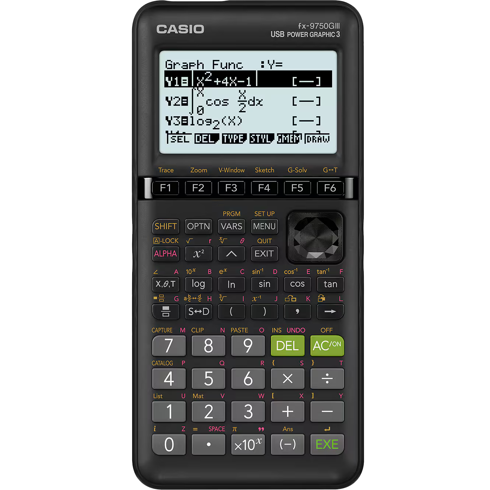

# casio-fx9750giii-mod
documenting my progress in squeezing an sbc into a Casio fx-9750GIII calc

ripped some traces from the 21-pin ribbon cable, oops.
black sharpie markings made by me

## Keypad matrix

|        | T710  | T711 | T712 | T713 | T714 | T715  | T716  | T717  | T718 | T719 |
|--------|-------|------|------|------|------|-------|-------|-------|------|------|
| **T703** | AC/ON |      |      |      |      |       |       |       |      |      |
| **T704** |       |      |      |      |      | →     | tan   | Right | Up   | F6   |
| **T705** |       | EXE  | −    | ÷    |      | ,     | cos   | Down  | Left | F5   |
| **T706** |       | (-)  | +    | ×    | DEL  | )     | sin   | EXIT  | MENU | F4   |
| **T707** |       | x10ˣ  | 3    | 6    | 9    | (     | ln    | ^     | VARS | F3   |
| **T708** |       | .    | 2    | 5    | 8    | S<>D  | log   | x²    | OPTN | F2   |
| **T709** |       | 0    | 1    | 4    | 7    | a/b | X,θ,T | ALPHA | SHIFT| F1   |

unused: T701, T702
